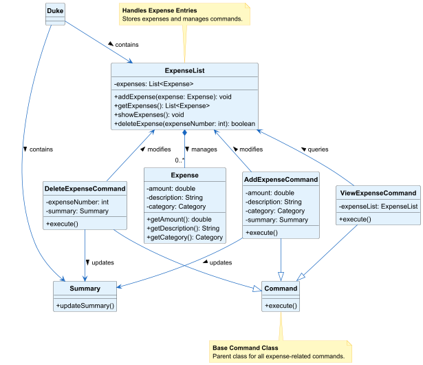
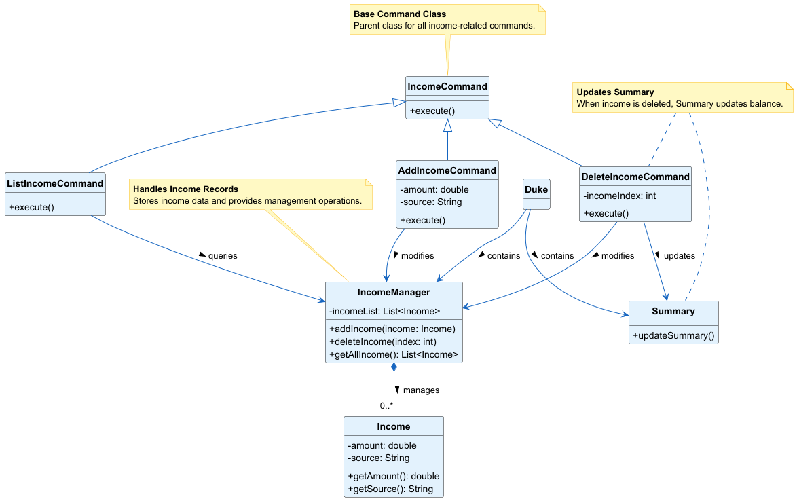
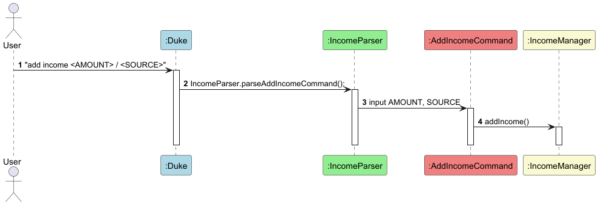
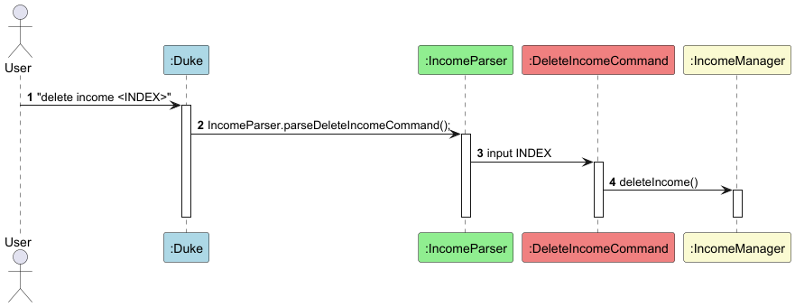
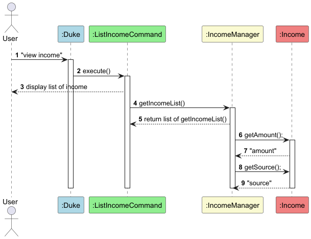
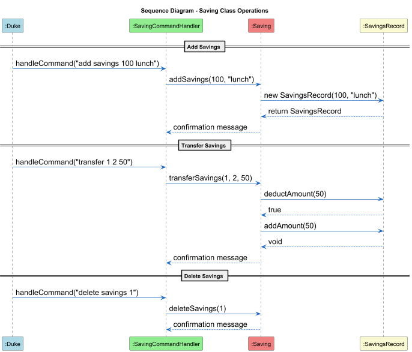

# Common Cents Developer Guide

## About Common Cents
Common Cents is a personal finance management application that helps you track your income, expenses, savings,
and financial goals. The application provides a command-line interface for managing your finances with features for
budget tracking, savings management, and financial alerts.

* [Acknowledgements](https://ay2425s2-cs2113-t11a-4.github.io/tp/DeveloperGuide.html#acknowledgements)
* [Design & Implementation](https://ay2425s2-cs2113-t11a-4.github.io/tp/DeveloperGuide.html#design--implementation)
  * [Expense](https://ay2425s2-cs2113-t11a-4.github.io/tp/DeveloperGuide.html#expense-component)
  * [Income](https://ay2425s2-cs2113-t11a-4.github.io/tp/DeveloperGuide.html#income-component)
  * [Savings](https://ay2425s2-cs2113-t11a-4.github.io/tp/DeveloperGuide.html#savings-component)
  * [Summary](https://ay2425s2-cs2113-t11a-4.github.io/tp/DeveloperGuide.html#summary-component)
  * [Summary Display](https://ay2425s2-cs2113-t11a-4.github.io/tp/DeveloperGuide.html#summary-display-component)
  * [Help Display](https://ay2425s2-cs2113-t11a-4.github.io/tp/DeveloperGuide.html#help-display-component)
  * [Funds Alert](https://ay2425s2-cs2113-t11a-4.github.io/tp/DeveloperGuide.html#funds-alert-component)
* [Product Scope](https://ay2425s2-cs2113-t11a-4.github.io/tp/DeveloperGuide.html#product-scope)
* [Features Coming Soon](https://ay2425s2-cs2113-t11a-4.github.io/tp/DeveloperGuide.html#features-coming-soon)
* [User Stories](https://ay2425s2-cs2113-t11a-4.github.io/tp/DeveloperGuide.html#user-stories)
* [Non-Functional Requirements](https://ay2425s2-cs2113-t11a-4.github.io/tp/DeveloperGuide.html#non-functional-requirements)
* [Glossary](https://ay2425s2-cs2113-t11a-4.github.io/tp/DeveloperGuide.html#glossary)
* [Instructions for Manual Testing](https://ay2425s2-cs2113-t11a-4.github.io/tp/DeveloperGuide.html#instructions-for-manual-testing)

## Acknowledgements

Common Cents uses the following tools for development and testing:

1. [JUnit 5](https://junit.org/junit5/) - Used for software testing.
2. [Gradle](https://gradle.org) - Used for build automation.
3. [AB3](https://github.com/se-edu/addressbook-level3) - Inspired the format of our DG.

## Design & Implementation

### Expense Component

The Expense component allows users to add, view, and delete expenses while categorizing them.

Here is the class diagram of the Expense Component:


#### API: Expense.java
How the Expense Component works:

1. Adding Expense: The `AddExpenseCommand` extends the `Command` class, and contains amount, description and category 
of the added expense. `ExpenseParser` class parses the command input by the user. When the `AddExpenseCommand` is
called, the `parseAddExpense()` function splits the user input into amount, description and category respectively. The 
inputs are sent to the `AddExpenseCommand` class, which adds the expense into `ExpenseList`.
   

2. Viewing Expense: The `ViewExpenseCommand` extends the `Command` class, and allows the user to view their list of
expenses. Upon user input, `ViewExpenseCommand` class is called, and takes in the `ExpenseList` as a parameter. In the 
`ExpenseList` class, all previously added expenses are accessed via the `List<Expense> expenses` ArrayList. The 
`showExpenses()` command is called and a numbered list is shown.
   

3. Deleting Expense: The `DeleteExpenseCommand` class extends the `Command` class, and allows the user to delete an 
expense based on its number in the expense list. Upon user input, `ExpenseParser` class parses the input, calling 
`parseDeleteExpense()`, which takes the input integer. By calling `DeleteExpenseCommand`, `DeleteExpenseCommand` gets the 
item to be deleted from the `ExpenseList` class and successfully deletes it.

Why it's implemented this way:

* Using an extension of the Command class allows each user action (Add, View, Delete) to be encapsulated in a separate 
class. 
  This makes it easier to:
  * Extend functionality without modifying existing commands.
  * Maintain Single Responsibility Principle (SRP), where each command class only does one thing.
  * Track each command without going through a bunch of code.

* Instead of treating categories as plain strings, we use Enums:
  * Prevents invalid categories as FOOD, TRANSPORT, BILLS, OTHERS categories are predefined.
  * More efficient and avoids checking string values at runtime.

For example, in the `Expense` class:
```java
public enum Category {
    FOOD, TRANSPORT, BILLS, OTHERS
}
public static Category getCategoryFromInput(String input) throws BudgetTrackerException {
    switch (input.toUpperCase()) {
    case "F":
        return Category.FOOD;
    case "T":
        return Category.TRANSPORT;
    case "B":
        return Category.BILLS;
    case "O":
        return Category.OTHERS;
    default:
        throw new BudgetTrackerException("Invalid category! Use: F (Food), T (Transport), B (Bills), O (Others).");
    }
}
```

Alternatives considered:
* Direct handling of user input in `Expense` class instead of `ExpenseParser`.
Example:
```java
public void executeCommand(String userInput) {
    if (userInput.startsWith("add expense")) {
        // Parse and add expense
    } else if (userInput.equals("view expense")) {
        // View expenses
    }
}
```
However, this would violate Single Responsibility Principle, as `Expense` class is used to manage expenses,  and not 
parse user input. It would also make it hard to extend, as adding new commands would require modifying `Expense` class,
making it harder to maintain. `ExpenseParser` separates user input handling from other logic, making the system more 
modular and maintainable.


### Income Component

The Income component is a critical part of the budget tracker, allowing users to add, delete,
and list their income entries. The goal of this feature is to provide students with a simple and efficient way
to record their income sources, making it easier for them to manage their finances over time. 

#### API: Income.java

Here is the class diagram of the Income Component:


How the Income Component works:

1. Adding Income: The `AddIncomeCommand` class is responsible for parsing and adding income to the system. The 
IncomeManager adds a new Income instance to the list of income records stored in the model.
Example:
```java
public class AddIncomeCommand implements Command {
    private final String amount;
    private final String source;

    public AddIncomeCommand(String amount, String source) {
        this.amount = amount;
        this.source = source;
    }

    @Override
    public void execute() {
        Income income = new Income(amount, source);
        incomeManager.addIncome(income);
    }
}
```



2. Deleting Income: The `DeleteIncomeCommand` class handles the deletion of income entries. The manager removes the 
selected Income record from the list.
Example:
```java
public class DeleteIncomeCommand implements Command {
    private final int incomeIndex;

    public DeleteIncomeCommand(int incomeIndex) {
        this.incomeIndex = incomeIndex;
    }

    @Override
    public void execute() {
        incomeManager.deleteIncome(incomeIndex);
    }
}
```


3. Listing Income: The `ListIncomeCommand` class retrieves the list of all income entries and displays them to the 
user through the view.
Example:
```java
public class ListIncomeCommand implements Command {
    @Override
    public void execute() {
        List<Income> incomeList = incomeManager.getAllIncome();
        incomeView.displayIncome(incomeList);
    }
}
```



Why it's implemented this way:

* Separation of Concerns: By using separate classes for the model, manager, and view, the system remains modular, 
making it easier to maintain and extend in the future.

* Scalability: This design allows for easy expansion of features in the future, such as adding additional attributes 
to income (e.g., categories like salary, allowance, etc.) or adding additional functionality like categorizing income.

* Simplicity for Users: Students should find the interface intuitive, allowing them to easily manage their income 
entries without unnecessary complexity.

Alternatives considered:

* Single Command Class: Another approach was to have a single IncomeCommand class that would handle all actions 
(add, delete, list). However, this would lead to bloated code and a lack of clarity, so we chose to separate the 
commands into individual classes.

### Savings Component
The savings component is an important component of the Budget Tracker, and it allows
students to add, delete, view saving amounts, and set, update, delete view savings goal
for each of the saving entry.

#### API: Saving.java

Here's the class diagram of the Saving component:


How the Saving component works:

In the main method which is called Duke, when it detects input contains "savings" string,
the main method will then call processSavingCommand() in SavingCommandHandler.java then the method 
will check if input contains other strings like "add savings", "delete savings", etc., then call
the corresponding method to dealt with the input command.

Saving sequence diagram: (below only used the execution of 1 method as example,
the sequence diagram of other methods are similar)


Why it's implemented this way:
1. Used a separate class to handle all commands related to saving records to reduce coupling
2. Implemented run() method in Saving.java to improve the neatness of whole program

The `getSavingsIndicator()` method calculates a savings indicator based on the total savings and the total income of the
user. This indicator provides feedback to the user regarding their saving habits by categorizing them into three levels:

* Good: Savings are 80% or more of the total income.
* Neutral: Savings are between 50% and 80% of the total income.
* Bad: Savings are less than 50% of the total income.

This feature aims to help users gauge their financial behavior and make informed decisions about saving.

How this code works:
* Total Income: The method retrieves the user's total income from the `Summary` class using the `getTotalIncome()`
  method.

* Total Savings: The method iterates through all savings records stored in the `savingsRecords` list and calculates
  the total savings.

* Comparison Logic:

    * The method compares the ratio of total savings to total income.

    * Based on this ratio, it determines whether the savings are "Good," "Neutral," or "Bad."

The logic ensures that the user gets a meaningful indicator of their saving habits, encouraging them to either
increase or maintain their savings rate.

Why it's implemented this way:
* Why Use Ratio: The ratio of savings to income provides a simple but effective way to evaluate savings behavior. This
  method offers clarity to the user by presenting an easily understandable percentage-based feedback system.

Alternatives considered:
* Keeping a more rigid approach with fixed thresholds (e.g., "Good" for 80% or more, "Bad" for less than 50%, and
  "Neutral" in between) could have been sufficient for basic applications. However,
  this would lack the adaptability that a more dynamic solution could provide, especially for users with different
  financial situations.

### Summary Component

The Summary component is the central financial data hub of the application that maintains all financial information and coordinates updates between different components through the Observer pattern.

#### API: Summary.java

Here's the class diagram of the Summary component:

<div align="center">
  
</div>

How the Summary Component works:

1.  **Central Data Repository**: The `Summary` class acts as a manager for financial data. It maintains running totals for income, expenses, and savings.
2.  **Observer Pattern for Updates**: `Summary` implements the Subject role in the Observer pattern.
    *   Components interested in financial changes (`FundsAlert`) register themselves as observers using `Summary.registerObserver()`. `Summary` keeps a list of these observers.
    *   Whenever a financial value changes (e.g., adding income, removing savings), `Summary` calls its internal `notifyObservers()` method.
    *   This method iterates through the list of registered observers and calls the `update()` method on each one, passing the latest financial state (available funds, totals).
    *   This mechanism allows components like `FundsAlert` to react to financial changes without `Summary` needing specific knowledge of what those components do.
3.  **Interaction with Commands**: Various command classes (e.g., `AddIncomeCommand`, `AddExpenseCommand`, `DeleteExpenseCommand`) interact directly with the `Summary` component to modify the financial state. Each command encapsulates a specific financial operation.
4.  **Data Provision**: `Summary` provides getter methods (e.g., `getTotalIncome()`, `getAvailableFunds()`) allowing other components like `SummaryDisplay` and `Saving` to retrieve the current financial information for display or calculation purposes.
5.  **Data Validation**: Methods within `Summary` that modify financial data (e.g., `addExpense`, `removeSavings`) include validation checks to ensure data integrity, such as preventing negative amounts or ensuring expenses don't exceed available funds.

Why it's implemented this way:

1.  **Maintain Data Integrity**: Centralizing financial data management in one component ensures consistency and reduces the risk of data synchronization errors across the application.
2.  **Support Loose Coupling**: The Observer pattern decouples the `Summary` component (the data source) from components that react to data changes (the observers). This makes the system more flexible and easier to modify, as observers can be added or removed without changing `Summary`.
3.  **Enable Extensibility**: New features requiring awareness of financial changes (e.g., different types of alerts or reports) can be implemented as new observers and registered with `Summary` without altering its core logic.
4.  **Facilitate Testing**: The clear separation of responsibilities (data management vs. reacting to changes) makes it easier to test the `Summary` component and its observers in isolation.

Alternatives considered:

*   **Direct method calls:** Instead of the Observer pattern, commands or `Summary` itself could directly call methods on components like `FundsAlert` whenever data changes. This was avoided as it would create tight coupling, making the system harder to modify and extend. If `FundsAlert` changed its method signature, `Summary` or multiple command classes might need updating.
*   **Storing transaction history:** Instead of maintaining running totals, the `Summary` could store a list of all individual income/expense/savings transactions. While offering a more detailed history, this approach would require recalculating totals every time a summary is needed, potentially impacting performance for large datasets, and might complicate the state management for features like the current available balance.

### Summary Display Component

The SummaryDisplay component formats and presents financial data to the user in a readable format.

#### API: SummaryDisplay.java

The sequence diagram below illustrates how the Summary Display component interacts with the Summary component:

<div align="center">
  
</div>

How the SummaryDisplay component works:

1. The `SummaryDisplay` is initialized with a reference to the `Summary` object.
2. When the user enters `view summary`, the command is processed by Duke and forwarded to `SummaryDisplay.displaySummary()`.
3. `SummaryDisplay` retrieves all necessary financial data from the `Summary` object.
4. The data is formatted into a readable text block and displayed to the user.

Why it's implemented this way:
* Separating display logic from data management follows the Single Responsibility Principle.
* The component depends only on the public interface of `Summary`, making it resilient to internal changes in the data model.


Alternatives considered:
* **Embedding display logic:** The logic for formatting and displaying the summary could have been placed directly within the `Summary` component or the main `Duke` class. This was rejected because it would violate the Single Responsibility Principle, mixing data management/application logic with presentation concerns, leading to lower cohesion and making the code harder to maintain.
* **Direct data structure access:** `SummaryDisplay` could have accessed the internal data structures of `Summary` directly. This was avoided to maintain loose coupling; depending only on the public API makes `SummaryDisplay` less likely to break if the internal implementation of `Summary` changes.


### Help Display Component

The HelpDisplay component provides users with information about available commands and their usage.

#### API: HelpDisplay.java

How the HelpDisplay component works:

1. The `HelpDisplay` class is a simple component that formats and displays help information.
2. When the user enters `help`, Duke calls `helpDisplay.displayHelp()`.
3. The component outputs a formatted list of commands and their usage.

Why it's implemented this way:
* Centralizing help text in one component makes it easier to maintain and update as commands change.
* The straightforward approach prioritizes clarity and maintainability over complexity.


Alternatives considered:
* **Distributing help text:** Help information could have been stored within each respective command class. This was deemed less maintainable, as updating or viewing all help information would require checking multiple files.

### Funds Alert Component

The FundsAlert component implements a warning system that alerts users when their available balance falls below a set threshold.

#### API: FundsAlert.java, FinancialObserver.java

How the Funds Alert Component works:

1.  `FundsAlert` implements the `FinancialObserver` interface to receive updates from the `Summary` component.
2.  It maintains a warning threshold (default $5.00) that can be customized by the user.
3.  When financial data changes, the `Summary` component calls the `update()` method of all registered observers.
4.  `FundsAlert` checks if available funds are below the threshold and displays a warning if necessary.

The sequence diagram below shows what happens when a user sets an alert threshold:

<div align="center">
  
</div>

Setting an alert threshold (as shown in the **Set Alert Sequence Diagram** above):
1. When the user enters `alert set 20`, the command is parsed by `AlertParser`.
2. An `AlertCommand` is created and executed.
3. The command calls `fundsAlert.setWarningThreshold(20.0)` to update the threshold stored within the `FundsAlert` instance.


The sequence diagram below shows what happens when an alert is triggered:

<div align="center">
  
</div>

_(Note: Activation bars omitted to reduce clutter due to size of the sequence diagram)_


Triggering an alert (as illustrated in the **Trigger Alert Sequence Diagram** above):
1. When the user adds an expense that reduces available funds below the threshold, the corresponding command updates the `Summary`'s financial data.
2. `Summary` then calls `notifyObservers()`, which in turn calls the `update()` method on the registered `FundsAlert` instance.
3. `FundsAlert`'s `update` method calls `checkAndDisplayAlert()`, which compares the current available funds to the threshold and, if funds are too low, instructs the UI to display the warning message.

Why it's implemented this way:
* The Observer pattern allows FundsAlert to be notified of financial changes without tight coupling to Summary.
* This design makes it easy to add new types of financial observers without modifying Summary.
* Displaying the initial notification at startup ensures users are aware of this feature from the beginning.

Alternatives considered:
* Checking funds after each transaction in Duke.java, but this would scatter alert logic throughout the codebase.
* A polling approach where alerts check the summary periodically, but this would be less efficient and responsive.
* Not showing an initial notification, but this would reduce user awareness of the feature.

## Product Scope

### Target user profile:
* First year university undergraduates living in on-campus accommodations
* has a need to manage finances confidently
* can type fast
* prefers typing to mouse interactions

## Features coming soon

### Local Saving to Disk

**Planned Feature:** We plan to implement functionality to save all financial data (income, expenses, savings, alert settings) locally to a file on the user's disk. This will allow users to persist their data between application sessions.

**Reason for Delay:** Implementing local storage requires careful consideration of file formats, data serialization, error handling (e.g., corrupted files), and user experience for loading/saving data. We prioritized the development of core functionalities like tracking income/expenses, managing savings, viewing summaries, and setting alerts to deliver a functional baseline product first. The effort required for robust local saving was deferred to focus on these essential features.

## User Stories

| Version | As a ...          | I want to ...                                                  | So that I can ...                                      |
|---------|-------------------|----------------------------------------------------------------|--------------------------------------------------------|
| v1.0    | new user          | see usage instructions                                         | refer to them when I forget how to use the application |
| v1.0    | user              | be able to navigate through the CLI                            | efficiently use the application                        |
| v1.0    | user              | have access to a "help" command                                | view all possible commands and their usage             |
| v1.0    | user              | know when an action is invalid                                 | correct my input and avoid errors                      |
| v1.0    | user              | view a summary of my finances                                  | understand my current financial situation              |
| v1.0    | user              | input income                                                   | compare it with expenses                               |
| v2.0    | financial planner | get an alert when my account balance is below a certain amount | avoid overspending and maintain financial discipline   |
| v2.0    | user              | navigate through the CLI easily                                | save time and effort while managing my finances        |
| v2.0    | user              | view indicators (good/bad) based on amount saved               | discourage excessive spending                          |
| v2.0    | user              | transfer certain amount of savings from one entry to another   | toggle amount of savings for different saving goals    |

## Non-Functional Requirements

1. **Compatibility**
   * Should work on any mainstream OS as long as it has Java 17 or above installed.
   * Should be able to run without requiring an internet connection.

2. **Performance**
   * Should be able to hold up to 1000 financial records (combined income, expenses, and savings) without a noticeable sluggishness in performance for typical usage.
   * All commands should execute and display results within 2 seconds on a typical modern computer.

3. **Usability**
   * A user with a typing speed of at least 30 to 40 words per minute (WPM) for regular English text should be able to accomplish most tasks at about the same speed as with a mouse-driven GUI application.
   * Error messages should be clear and provide guidance on how to correct invalid inputs.

## Glossary

* **Mainstream OS** - Windows, Linux, Unix, macOS
* **CLI** - Command Line Interface, where users interact with the application by typing commands
* **Income** - Money received, typically on a regular basis, from work, investments, or other sources
* **Expense** - Money spent on goods or services
* **Savings** - Money set aside for future use, not immediately spent
* **Available Funds** - The amount of money available for spending, calculated as Total Income - Total Expenses
* **Financial Observer** - A component that monitors changes in financial data and responds accordingly
* **Alert Threshold** - The minimum amount of available funds below which the system will display a warning
* **Savings Goal** - A target amount of money to be saved for a specific purpose

## Instructions for manual testing

### Set up the program
1. Ensure you have Java 17 or above installed.
2. Download the latest JAR file from [here](https://github.com/AY2425S2-CS2113-T11a-4/tp/releases) under latest release.
3. Copy the file to the folder you want Common Cents to be in.
4. Open your terminal and cd into the folder Common Cents is in.
5. Run the file by inputting `java -jar commoncents.jar`

### Testing the program
Upon running the JAR file, you should see a welcome message.
```
Welcome to Common Cents!
Use `help` to see available commands.
Funds Alert feature is active. You will be warned when available funds fall below $5.00.
Use 'alert set <amount>' to change this threshold.
```
Now you can perform the following tests:

#### Adding Expenses
1. Command: `add expense 25 / lunch / f`

    Expected:
    ```
    Added expense: [FOOD] $25.0 for lunch
    ```
2. Command: `add expense 5 / MRT / t`

    Expected:
    ```
    Added expense: [TRANSPORT] $5.0 for MRT
    ```
3. Command: `add expense 50 / hostel stay / b`

    Expected: 
    ```
    Added expense: [BILLS] $50.0 for hostel stay
    ```
4. Command: `add expense 20 / shopping / o`

    Expected:
    ```
    Added expense: [OTHERS] $50.0 for shopping
    ```
5. Command: `add expense 20 / shopping / n`

    Expected: throws an error for invalid category.


6. Command: `add expense `

    Expected: throws an error for invalid format.

#### Viewing list of expenses
1. Command: `view expense`

    Expected: a numbered list of expenses.

#### Deleting expenses
1. Command: `delete expense 1`

    Expected: expense with index 1 deleted.


2. Command: `delete expense 0`, `delete expense -1`, `delete expense <OUT_OF_BOUNDS>`

    Expected: throws an error for invalid index.
    
    
#### Viewing Help
1. Command: `help`

    Expected: displays the help menu.

#### Viewing Summary
1. Command: `add income 500 / salary`

    Expected: as described in previous section


2. Command: `view summary`

    Expected: Summary with updated income and available balance


3. Command: `add expense 200 / lunch / F`

    Expected: as described in previous section


4. Command: Summary with updated expense and available balance

#### Setting and Triggering Funds Alert
1. Command: `alert set 100`

    Expected: Notification with the new funds alert displayed


2. Command: `add expense 250 / rent / B`

    Expected: The alert triggers before the expense confirmation as available balance goes below available funds
    *(Note: Assumes income was positive before this, resulting in a valid balance before this command)*


3. Command: `alert set -10`

    Expected: An error message indicating the threshold cannot be negative.

